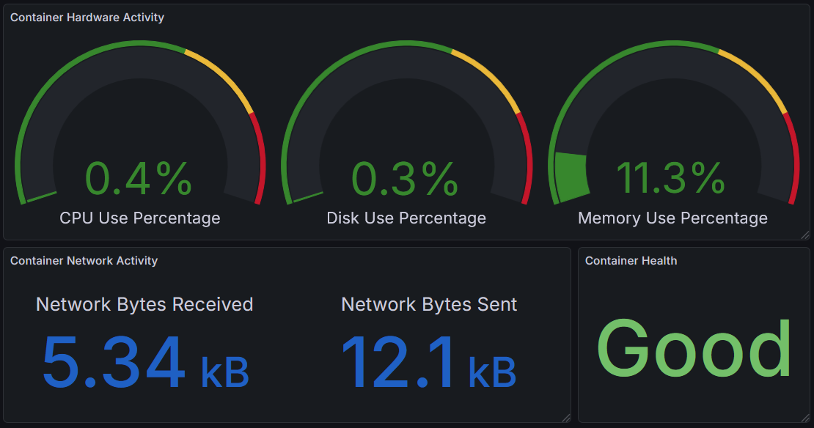
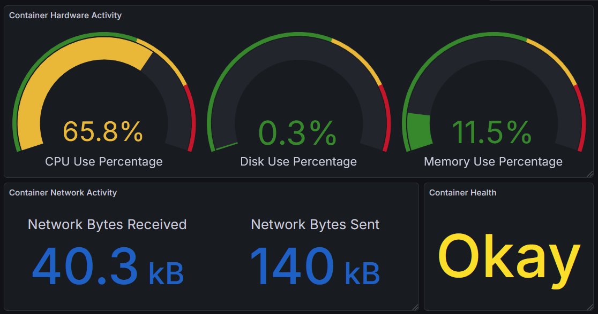
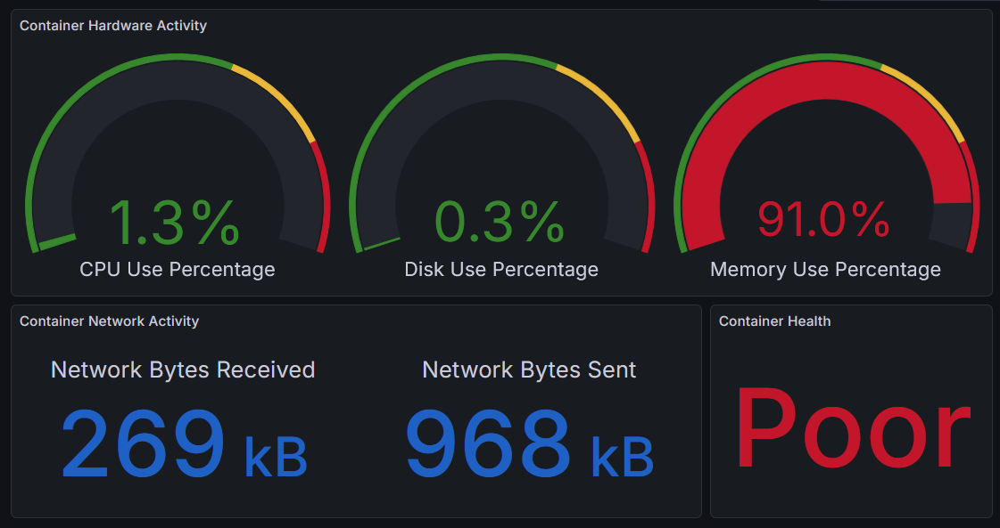

# System Monitoring Dashboard

## Overview
**System Monitoring Dashboard** is a lightweight, containerized system monitoring project designed to track CPU, memory, disk, and network usage in real-time. It leverages **Docker**, **Prometheus**, and **Grafana** to collect metrics, visualize system performance, and display a health status indicator based on resource utilization. This project was inspired by online tutorials on Prometheus and Grafana.


---

## Features
- Collects system metrics (CPU, memory, disk, network) using Python and **psutil**  
- Metrics exposed in **Prometheus** format for monitoring  
- Real-time dashboards in **Grafana** with visualizations and gauges  
- Threshold-based health status: Good, Okay, Poor  
- Fully containerized with **Docker Compose** for easy setup  
- Configurations and dashboards documented for reproducibility  

---

## Technologies Used
- **Languages:** Python 3  
- **Monitoring Tools:** Prometheus, Grafana, psutil  
- **Containerization:** Docker, Docker Compose  
- **Operating System:** Linux (Ubuntu / Lubuntu compatible)  
- **Version Control:** Git / GitHub  

---

## Installation

### Prerequisites
- Docker and Docker Compose installed  
- Git installed  

### Steps
1. Clone the repository:  
```bash
git clone https://github.com/21LippsRo/system-monitor.git
cd system-monitor
```

2. Build and start containers:  
```bash
docker-compose up -d
```

3. Access Grafana:  
- Open your browser and go to `http://localhost:3000`  
- Default credentials: `admin` / `admin` (change on first login)  

4. Access Prometheus metrics:  
- `http://localhost:5000/metrics`  

---

## Usage
- The **Grafana dashboards** visualize CPU, memory, disk, and network usage.
- Health status gauge indicates overall system performance:  

| Status | Description | Example Image |
|--------|------------|---------------|
| **Good** | All metrics within safe thresholds |  |
| **Okay** | One or more metrics approaching high utilization |  |
| **Poor** | One or more metrics exceeded threshold |  |

- Dashboards are fully customizable in Grafana.
- Metrics update in real-time, with alerts triggered based on thresholds.

---

## Project Structure
```
system-monitor/
│
├── app.py                  # Python script collecting system metrics
├── Dockerfile              # Defines Python container
├── docker-compose.yml      # Sets up Python, Prometheus, and Grafana containers
├── prometheus.yml          # Prometheus configuration file
├── dashboards/             # Grafana dashboard JSON files
├── README.md               # Project documentation
└── requirements.txt        # Python dependencies
```

---

## Future Improvements
- Add **email or Slack notifications** for threshold alerts  
- Extend monitoring to **multiple containers or remote hosts**  
- Implement **historical trend analysis** with automated reports  
- Explore integration with **Kubernetes clusters** for containerized environments  

---

## License
This project is licensed under the MIT License. See `LICENSE` for details.